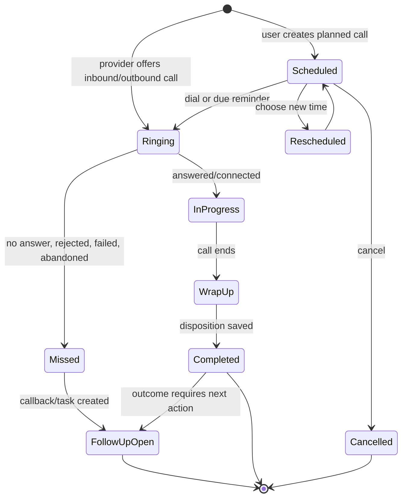

# New Call Functionality And Flow

## Purpose

Define one complete, non-duplicative Calls capability for the CRM. A **call** is a first-class CRM activity and its immutable interaction record is the source of truth. Dialing, routing, queues, notes, recordings, transcripts, tasks, coaching, and reporting all enrich or act on that same record; they must not maintain competing call histories.

This specification supersedes neither existing CRM activity concepts nor a telephony provider. It defines the CRM contract that a built-in softphone, external desk/mobile phone, and approved telephony providers must all satisfy.

## Research Basis

The baseline was synthesized from [Causing Portal Detailed Calls Specification](../Causing_Portal_Detailed_Calls_Specification.docx) and [HubSpot Calls CRM Summary](../HubSpot_Calls_CRM_Summary.docx), then checked against the following ten products and their official documentation. Product behavior is used as research input, not copied implementation.

| Product | Research signal incorporated |
| --- | --- |
| [HubSpot](https://knowledge.hubspot.com/calling/make-calls) | CRM activity association, call queues, logging, recordings, conversation intelligence |
| [Salesforce Voice](https://help.salesforce.com/s/articleView?id=sf.voice_about.htm&type=5) | Provider-backed voice, queues, supervisor controls, quality monitoring, transcription and sentiment |
| [Zendesk Talk](https://support.zendesk.com/hc/en-us/articles/4408842948378-About-Zendesk-Talk) | Service routing and ticket-linked call handling |
| [Freshsales](https://www.freshworks.com/crm/features/phone/) | CRM dialer and contextual calling |
| [Pipedrive](https://support.pipedrive.com/en/article/caller) | Click-to-call, mobile logging, caller identification, missed-call callbacks, marketplace telephony |
| [Zoho CRM](https://help.zoho.com/portal/en/kb/crm/sales-force-automation/activities/articles/log-calls) | Current/completed/scheduled calls, configurable fields, associations, import, follow-up activities |
| [RingCentral](https://www.ringcentral.com/office/features/call-logs.html) | Searchable/exportable call history, scheduled reports, playback, cost and productivity analysis |
| [Aircall](https://aircall.io/call-center-software/call-logging/) | Provider-to-CRM synchronization, tags, notes, and support workflows |
| [CloudTalk](https://www.cloudtalk.io/call-center-software/call-logging/) | Automatic logging, dispositioning, recordings, tags, and analytics |
| [Dialpad](https://help.dialpad.com/docs/call-history) | Directional history, redial, contact creation, blocking, and call-history actions |

## Product Principles

1. **One call, one canonical record.** A provider event, manual log, recording, transcript, task, and report reference `call_id`; synchronization may update known fields but cannot create duplicates.
2. **Context before connection.** Agents see the matched person, account, open work, previous interactions, consent, and ownership before answering or dialing.
3. **Logging is reliable by default.** Provider calls auto-log; offline/external calls can be logged manually. A failed sync is visible and retryable.
4. **Human decisions remain explicit.** Automation may propose an outcome, summary, or follow-up, but the agent confirms the disposition and any customer-facing action.
5. **Governed by design.** Recording, transcription, redaction, retention, export, and access respect tenant policy, regional consent requirements, and role permissions.

## Scope And Terminology

| Term | Meaning |
| --- | --- |
| Call | A planned, in-progress, or completed voice interaction, including unsuccessful attempts. |
| Call leg | One provider connection within a call: agent, customer, transfer, conference participant, or voicemail. |
| Interaction record | The canonical CRM call log, keyed by `call_id`. |
| Disposition | A required, controlled result selected when a call is wrapped up. |
| Outcome | The business result of the call, separate from connection status; for example, `Qualified` or `Follow-up required`. |
| Queue | A prioritized worklist of eligible calls/contacts for a team or user. It is not a second call log. |
| Follow-up | A linked future task, call, meeting, or workflow triggered from a call. |
| Wrap-up | The short post-call state in which the agent completes required metadata. |

## Capability Model

### 1. Call Creation And Identity

- Create calls from a contact, lead, company/account, deal/opportunity, ticket/case, campaign, custom object, queue, calendar, global dialer, API, import, or provider webhook.
- Support `inbound`, `outbound`, `internal`, `transfer`, `conference`, `voicemail`, `missed`, and `callback` directions/types without treating each as a separate data model.
- Normalize phone numbers to E.164 while displaying a localized format. Preserve the original dialed/caller value for audit purposes.
- Match inbound numbers to CRM records using exact normalized number first, then controlled matching rules. Present an unresolved caller flow to search, create, merge, or defer association.
- Prevent duplicate records with provider event identifiers, idempotency keys, a configurable time window, and an agent-visible conflict resolution flow.
- Record source: softphone, desk phone, mobile device, click-to-call, provider import, manual entry, API, or bulk import.

### 2. Telephony And Live Call Control

- Click-to-call from every eligible phone field and a global dial pad.
- Device selection and availability status: available, busy, away, do-not-disturb, offline, and signed out.
- Start, answer, decline, end, hold/resume, mute, keypad/DTMF, speaker/device switch, and redial.
- Warm transfer, blind transfer, consult, conference/add participant, park, forward, and escalation where supported by the provider.
- Incoming-call pop-up with identity, owner, account, open deals/tickets, recent activities, caller timezone/language, and allowed actions.
- Caller-ID configuration, business/outbound numbers, number masking, approved-number validation, and emergency-number policy.
- Voicemail playback, transcription when enabled, callback, assignment, and conversion into a linked follow-up.
- Optional inbound routing: business hours, IVR, skills/language, round robin, least-recently-used, priority/VIP, assigned-owner-first, overflow, and after-hours handling.
- Explicit degradation behavior: if CRM context fails, the provider call may continue; if telephony fails, preserve the drafted log and offer retry or manual completion.

### 3. Call Logging And Lifecycle

#### Canonical lifecycle

- **Scheduled:** Create a future outbound call with owner, due time, timezone, reminder, purpose, related records, queue, and optional script.
- **Ringing/In progress:** Capture provider timestamps and state transitions automatically. Show the call timer and allow notes during the call.
- **Missed/failed:** Capture the reason distinctly: no answer, busy, declined, invalid number, network/provider failure, abandoned, blocked, or voicemail. Do not misclassify every non-connected call as `No answer`.
- **Wrap-up:** Apply a configurable timer and required fields. The agent may save and continue later only if policy permits; managers receive an exception queue for overdue wrap-ups.
- **Completed:** Lock provider-originated technical facts while allowing authorized corrections through an auditable amendment rather than silent mutation.
- **Rescheduled/cancelled:** Retain the original scheduling activity and reason, linked to the replacement call where applicable.

#### Minimum log fields

| Group | Required fields |
| --- | --- |
| Identity | `call_id`, provider call ID(s), source, created by, owner/team, created/updated timestamps |
| Parties | direction, from/to number, participant list, caller identity status, CRM associations |
| Timing | scheduled time, start, answer, end, duration, ring time, wrap-up duration, timezone |
| Result | technical status, disposition, business outcome, purpose, failure reason, priority |
| Narrative | title/subject, agent notes, tags, summary, action items, objections/competitors when configured |
| Assets | recording reference, transcript reference, voicemail reference, attachments and redaction state |
| Continuity | follow-up IDs, queue/campaign, parent call for transfers, related ticket/deal/case, external URL |
| Governance | consent/recording notice status, retention class, access classification, audit/version history |

#### Configurable disposition taxonomy

Use one tenant-managed disposition catalog with optional per-team applicability. Suggested categories are:

| Connection status | Business outcomes |
| --- | --- |
| Connected, voicemail left, voicemail received, no answer, busy, wrong number, invalid number, declined, blocked, abandoned, provider failed | Qualified, unqualified, interested, not interested, information provided, issue resolved, issue escalated, callback requested, meeting booked, follow-up required, do-not-call requested, sale/order completed |

Require exactly one connection status at close. Require an outcome only for connected calls. Avoid separate fields that repeat the same intent, such as both `Result` and `Final status`; the disposition model is the authoritative classification.

### 4. CRM Context And Relationship Management

- Associate one call with multiple records, with one primary person/contact and optional company, lead, deal, ticket, campaign, and custom-object associations.
- Show the call once on each related record timeline, always as the same `call_id`.
- During and after a call, create/link notes, tasks, meetings, emails, SMS/WhatsApp conversations, tickets, deals, and knowledge articles.
- Show previous calls, open follow-ups, owner, lifecycle stage, SLA, consent, and customer preference in the call workspace.
- Offer duplicate contact detection and merge review when a previously unknown caller is created.
- Add a do-not-call preference immediately, suppress future automated dialing, and record its source and timestamp.

### 5. Queues, Campaigns, And Productivity

- Provide queues for uncontacted, due follow-ups, callbacks, inbound callbacks, campaign sequences, unassigned missed calls, and manager exception work.
- Define queue eligibility declaratively: segment, owner/team, stage, last-call date, contactability, consent, priority, SLA, timezone/business hours, retry count, and exclusion list.
- Order queue items by a visible policy: SLA, scheduled time, priority, account value, last-touch time, or configurable scoring. Log the selection rationale.
- Support manual next-call, preview dialing, progressive/power dialing, and provider-backed predictive dialing only where consent, local regulations, and capacity policy allow it.
- Give agents skip/defer with a reason, pause/leave queue, reserve/release item, and request reassignment. Never mark a skipped record complete.
- Support campaign scripts, approved snippets, required questions, and outcome-specific next steps without forcing the script into a call note.
- Enforce contact windows based on person timezone, consent, opt-out, frequency caps, and local calling restrictions.

### 6. Notes, Tasks, Automation, And AI

- Autosave time-stamped call notes with final editing at wrap-up. Clearly differentiate agent-authored notes from generated content.
- Create a linked follow-up task/call/meeting from a disposition, manual action, rule, or AI suggestion. The linkage is bidirectional and completion updates the originating timeline.
- Trigger workflows for missed calls, callbacks, escalations, new deals, DNC requests, sentiment/risk thresholds, SLA breaches, and unresolved wrap-ups.
- Generate optional recording transcription, searchable speaker-labelled transcript, concise summary, action items, topic/keyword detection, language detection, sentiment, and coaching insights.
- Display confidence, source timestamp, and a direct recording/transcript link for every AI assertion. Support agent edit/accept/reject and never overwrite the original transcript.
- Use permission-aware AI processing and redact configured card/payment, health, authentication, or sensitive data from transcript/search/export where supported.

### 7. Recording, Privacy, And Compliance

- Tenant and queue policies control whether recording is off, optional, automatic, on-demand, or paused for sensitive segments.
- Capture recording consent/notice state, policy version, jurisdiction, and pause/resume events on the call record.
- Separate recording availability from call logging: a call remains logged when recording is prohibited or fails.
- Support role and relationship-based playback/download permission, time-limited secure URLs, watermarking where required, audit trails, legal hold, deletion requests, and retention/disposition schedules.
- Let admins define retention by team, record type, jurisdiction, and call category. Deletion must remove/irreversibly detach underlying assets while retaining only legally permitted audit metadata.
- Do not expose recordings, transcripts, phone numbers, or sensitive AI outputs through exports/API to a user lacking equivalent in-product permission.

### 8. Search, History, And Reporting

- A unified call-history view supports saved filters, sort, column selection, bulk actions, and redial/callback. Filter by date, team, owner, queue, direction, status, disposition, outcome, number, contact, CRM object, campaign, provider, recording/transcript availability, and sync state.
- Global search indexes allowed call titles, numbers, contact/account identifiers, agent notes, tags, and transcripts. Indexing honors redaction and access policies.
- Export filtered metadata with role/policy controls; support scheduled, access-checked report delivery. Recording/transcript export is explicitly controlled separately.
- Operational dashboards: inbound volume, answer/abandon/missed rates, service level, queue wait, callback aging, transfer/escalation rate, provider errors, and availability.
- Sales dashboards: attempts, connect rate, conversations, dispositions, meetings booked, pipeline/revenue influence, average handle time, retry rate, and contactability by segment/campaign.
- Quality dashboards: recording coverage, wrap-up compliance, transcript/AI availability, sentiment/topic trends, coaching scorecards, audit events, and data retention health.
- Every metric declares its time basis, denominator, timezone, filters, inclusion/exclusion of test/internal calls, and owner attribution rule.

### 9. Administration, Access, And Integrations

- Roles: agent, team lead, manager, quality reviewer, administrator, compliance officer, integration service. Permissions are separately configurable for dialing, answering, routing, records, notes, recording, transcripts, AI, exports, configuration, and deletion.
- Use field/asset-level access controls, not just a blanket Calls-module permission. A manager may see aggregate metrics without transcript playback.
- Administrators configure providers/numbers, routing, business hours, queues, disposition catalogs, scripts, recording/retention, AI policy, mapping, webhooks, and rate limits.
- Integrate via provider adapters with an explicit capability matrix. Unsupported controls are hidden or explained, never simulated as successful.
- Provide versioned APIs and webhooks for call created/updated/completed, recording/transcript ready, disposition changed, sync failed, and follow-up created/completed. Require idempotency and signed webhook verification.
- Provider synchronization stores raw event references, mapped fields, processing state, last error, retry count, and a reconciliation timestamp. Admins can replay safe failures and view a dead-letter queue.
- Support CSV/XLSX import for historical calls with validation, association matching report, dry run, duplicate policy, immutable source row reference, and error file.

## Primary Workflows

### A. Outbound Queue Call

1. Agent joins an eligible queue and receives the next reserved contact with reason for priority, CRM context, contact window, and consent state.
2. Agent starts the call, selects a device/outbound number, and the CRM creates or updates the canonical call record with `Ringing` state.
3. On answer, the workspace displays the timer, script, notes, related records, and live controls. Provider events append technical timestamps and legs.
4. On end, the record enters `WrapUp`. The agent selects connection status, business outcome, tags, notes, and any required structured answers.
5. The outcome produces a linked next action when required. Automation may recommend a summary or task; the agent confirms it.
6. The record becomes `Completed`; the queue reservation is released and the next eligible item is offered. Recording/transcript/AI assets attach asynchronously to this same record.

### B. Inbound Known Caller

1. Provider sends a signed inbound event. CRM normalizes the number, finds permitted matches, and creates/updates a `Ringing` call.
2. Routing selects an eligible agent/queue. The pop-up shows caller, account, open work, previous interactions, preferences, and any relevant SLA.
3. Agent answers, transfers, conferences, or completes the call. Each transfer/conference is a leg under the same parent call.
4. At wrap-up, the agent classifies, notes, and either resolves the work or creates/links a ticket, task, meeting, or callback.
5. A missed inbound call creates a callback item for the configured owner/queue and is visible in missed-call reporting until acted on.

### C. Manual Or External Call Logging

1. User selects `Log call` from a CRM record or global activity creation.
2. User chooses current, completed, or scheduled. Completed calls require direction, timestamp, duration, contact/number, connection status, and notes; scheduled calls require owner and due time.
3. The CRM validates association, number normalization, call windows when scheduling, and disposition rules.
4. Save creates the same canonical record and can create a linked follow-up. Manual provenance remains visible; it cannot be presented as provider-verified duration/recording.

### D. Telephony Sync Failure And Reconciliation

1. A provider event fails validation, association, or persistence. The raw event is retained securely and a sync item becomes `Failed` with a non-sensitive diagnostic.
2. The user-facing call is marked `Sync pending` rather than silently disappearing. Agents may complete a manual log if operationally necessary.
3. The system retries idempotently with bounded backoff. An admin can correct mapping/association and replay only the affected event.
4. Reconciliation compares provider events against CRM records by provider IDs and time window, creates only missing canonical calls, and produces an auditable exception report.

## Delivery Priorities

| Release | Included capabilities |
| --- | --- |
| Foundation | Canonical model, manual/current/completed/scheduled logging, associations, core dispositions, notes, follow-ups, history/search, role permissions, CSV import, basic reporting |
| Connected calling | Provider adapter, click-to-call, inbound pop-up, automatic logging, live controls, queue/callback work, sync monitoring, recordings and policy controls |
| Intelligence and scale | Transcripts, AI assistance, coaching, advanced routing/dialing, quality dashboards, exports/scheduled reports, advanced compliance and provider reconciliation |

## Acceptance Criteria

- A single provider call with transfer legs appears once in CRM and is visible from every permitted related record.
- A completed call cannot be saved without its required connection status; a connected call also requires an outcome.
- A missed inbound call creates a traceable callback path without fabricating a successful interaction.
- A follow-up created from a call links both ways and appears in the appropriate task/call queue exactly once.
- An agent cannot view, play, download, search, or export a restricted recording/transcript through an alternate endpoint.
- Duplicate or retried provider webhooks do not duplicate a call, task, recording, or report metric.
- Search and reporting apply the same access and retention rules as the record detail view.
- Technical provider facts and agent-entered business context have separate provenance and audit history.
- A provider outage leaves agents able to preserve notes and manually log the interaction; recovery reconciles without data loss or duplication.

## Decisions Required

1. Select initial telephony provider(s), supported geographies, and whether a built-in softphone is in scope.
2. Approve the initial disposition catalog, required fields by team, retry/contact-window rules, and queue priority policy.
3. Set recording consent, transcription/AI, redaction, retention, legal hold, and deletion policies with legal/compliance owners.
4. Confirm CRM objects that can be associated to a call and their primary-association rules.
5. Define data residency, encryption, API/webhook authentication, availability objectives, and provider reconciliation SLAs.
