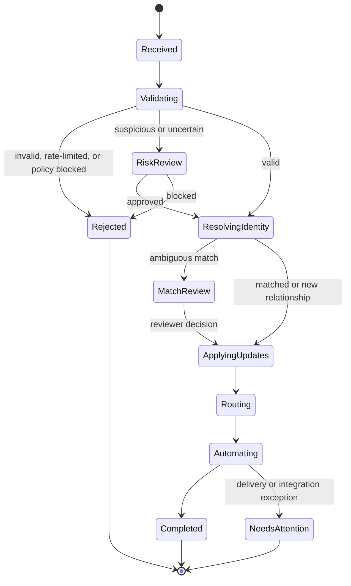
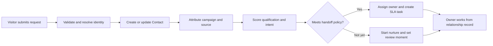

# CRM Forms: Functionality, Flow, and Experience Specification

## 1. Purpose

Forms are the CRM's relationship-entry surface. They turn an anonymous interaction into a trustworthy, useful CRM event: one that identifies or creates the right person, records exactly what was shared and consented to, attributes the origin, and gives one accountable teammate a clear next action.

This specification uses `Forms` to mean the complete system: form definition, public experience, submission processing, identity resolution, CRM updates, routing, automation, reporting, governance, and audit history. It is based on the supplied `HubSpot_Forms_CRM_Functional_Specification.docx` and a current review of comparable products.

### Product promise

> Ask only for what makes the next relationship action better.

The experience must feel calm to the respondent and decisive to the team. A visitor should never be asked to reconstruct information the CRM already knows. A seller or service owner should never need to hunt for the form, source, consent, or next step after a submission.

### Design principles

1. **Relationship before response.** A submission belongs to a person and their relationship history, not a spreadsheet-like inbox.
2. **Signal first, work next, history on demand.** The primary screen answers what needs attention and why; inspection and analytics remain available without competing for attention.
3. **One clear action per moment.** The form publisher, respondent, and assigned owner each see one obvious primary action.
4. **Progressive disclosure, not hidden risk.** Advanced controls are grouped under clear stages; safety-relevant choices are explicit before publishing.
5. **Known data is earned once.** Reuse trusted values, show a respectful identity-reset path, and ask the next most useful question rather than repeat profile fields.
6. **Human control over automation.** Routing and enrichment may recommend or execute policy, but exceptions are visible, reversible, and auditable.
7. **Accessibility and trust are features.** Keyboard operation, semantic labels, localized error messages, consent evidence, and predictable recovery are baseline behavior.
8. **Every submission is explainable.** A user can see why a record was matched, assigned, scored, suppressed, or sent to review.

## 2. Goals and Non-goals

### Goals

- Capture leads, requests, registrations, feedback, service cases, applications, payments, and preference updates in a CRM-native way.
- Create or update Contact, Company, Deal, Ticket, Campaign membership, Payment, and approved custom-object records from one submission.
- Preserve immutable submission evidence while allowing validated CRM properties to evolve.
- Reduce form friction with prefill, progressive profiling, conditional questions, sensible defaults, and field-level guidance.
- Route each actionable submission to a specific owner, queue, or workflow with a measurable service-level expectation.
- Give revenue, marketing, service, and operations teams a shared, attributable view of form performance and follow-through.
- Support embedded, standalone, popup, conversational, kiosk, API, and external-form-handler collection channels.

### Non-goals

- Replacing a full survey-research, document-generation, or e-signature platform.
- Treating browser identity, enrichment, or AI output as fact without a visible confidence level and remediation path.
- Allowing arbitrary field creation, routing, or third-party code to bypass governance.
- Using conversion optimization to obscure consent, coerce a response, or silently change relationship preferences.

## 3. Competitive Research and Product Decisions

The following are ten comparable form or CRM products reviewed as design benchmarks. This is a capability comparison, not an endorsement or a claim of feature parity. Product capabilities and commercial availability must be revalidated during implementation.

| Benchmark | Observed strength | CRM Forms decision |
| --- | --- | --- |
| HubSpot Forms | CRM-property fields, progressive/dependent fields, prefill, workflow triggers, routing notifications, hosted/embed distribution | Use native CRM schema fields, progressive profiling, explicit identity reset, and workflow entry from a canonical submission event. |
| Salesforce Account Engagement | Hosted forms and form handlers for external/custom forms, prospect fields, bot protection, gated-content patterns, kiosk/data-entry mode | Support both native forms and a secure handler/API path; distinguish shared-device or kiosk submission from browser-identified submission. |
| Adobe Marketo Engage | Enterprise lead capture and nurturing patterns | Make campaign membership, scoring, and nurture entry explicit, but keep the builder’s default path small and comprehensible. |
| Microsoft Dynamics 365 Customer Insights | Customer-journey-oriented capture and consent patterns | Treat consent and journey entry as first-class outcomes, with purpose, lawful basis, language, and evidence captured per submission. |
| Zoho CRM Web Forms | Direct CRM lead capture, approval, round-robin assignment, field/drop-off analytics, device analysis, and A/B testing | Include a lead-review lane, ownership rules, field friction analytics, and controlled experiments with a winner policy. |
| Pipedrive Web Forms | Simple visual blocks, lead/deal destination, embed/share, reCAPTCHA, consent field workaround | Keep a low-overload block builder and a clear destination choice, while providing native consent components rather than a workaround. |
| Freshsales | Lead capture, qualification, routing, intent signals, and a customer 360 view | Put qualification and ownership on the record timeline so representatives work from context, not a detached forms inbox. |
| ActiveCampaign | Inline collection tied to contact automation and follow-up | Make follow-up automation easy to begin but require review of audience, exit conditions, and owner handoff before publication. |
| Typeform | Conversational, focused question-at-a-time interaction and conditional branching | Offer a focused mobile-first layout when it lowers effort, while preserving accessible standard forms and avoiding novelty that harms task completion. |
| Jotform | Broad collection patterns, field-to-payment mapping, reusable payment connections, and test/live separation | Use reusable, permissioned connection profiles; isolate payment data, enforce test/live boundaries, and map CRM identifiers explicitly. |

### Research sources

- [HubSpot: Create forms](https://knowledge.hubspot.com/forms/create-forms)
- [Salesforce: Capture leads with forms and form handlers](https://help.salesforce.com/s/articleView?id=sf.pardot_forms.htm&type=5)
- [Zoho CRM: Smart web forms](https://www.zoho.com/crm/web-forms.html)
- [Pipedrive: Web Forms](https://support.pipedrive.com/en/article/web-forms)
- [Freshsales CRM](https://www.freshworks.com/crm/sales/)
- [Adobe Marketo Engage documentation](https://experienceleague.adobe.com/docs/marketo-engage/using/home.html)
- [Microsoft Dynamics 365 Customer Insights documentation](https://learn.microsoft.com/en-us/dynamics365/customer-insights/)
- [ActiveCampaign Help Center](https://help.activecampaign.com/)
- [Typeform Help Center](https://help.typeform.com/)
- [Jotform Help: Stripe integration](https://www.jotform.com/help/190-how-to-integrate-stripe-with-jotform/)

## 4. Information Architecture

The Forms module appears as one CRM menu item. Its screens are intentionally organized around work rather than configuration.

| Area | Primary question answered | Default primary action |
| --- | --- | --- |
| Overview | What submitted activity needs a human decision now? | Review the highest-priority submission |
| Forms | Which live form should I manage or improve? | Create form |
| Submissions | What happened, to whom, and what follows? | Open the focused CRM event |
| Builder | What is the minimum useful experience for this respondent? | Publish or save draft |
| Automations | What will happen after the form is submitted? | Add next action |
| Analytics | Where does friction or weak follow-through exist? | Investigate one insight |
| Library | Which approved fields, blocks, templates, and connections can be reused? | Use approved asset |
| Settings | Who may publish, collect, integrate, and access data? | Manage policy |

### Overview: one decision, then evidence

The Overview contains only:

- **Work next:** one prioritized card with person, intent, source form, confidence, owner, and due time.
- **Submission health:** three compact measures: actionable submissions, owner coverage, and conversion versus baseline.
- **One watch item:** for example, a field with an abnormal abandonment rate or an integration exception.
- **Recent activity:** a short feed, collapsed by default after five events.

It does not show a full analytics dashboard, every form, every workflow, or a generic activity table. Those are demand-driven views.

## 5. Core Domain Model

| Entity | Purpose | Key attributes |
| --- | --- | --- |
| Form | Versioned collection definition | ID, name, purpose, owner, status, channel, locale, brand, active version |
| Form version | Immutable published definition | schema snapshot, layout, rules, consent copy, destinations, checksum, published by/at |
| Field definition | Reusable approved question or CRM property binding | label, type, validation, sensitivity, object/property mapping, retention class |
| Block | Presentation or interaction unit | heading, rich text, field group, consent, payment, scheduler, file upload, calculation, divider |
| Submission | Immutable event received by the system | ID, received at, version, channel, raw payload, normalized values, IP/risk metadata, processing state |
| Identity resolution | Evidence of how a submission relates to CRM | candidate records, match factors, confidence, outcome, reviewer, override reason |
| Relationship update | Controlled CRM mutation from a submission | target object/property, old/new value, policy, update outcome, reversible flag |
| Routing decision | Ownership and next-work outcome | rule version, destination, owner/queue, SLA, reason, override history |
| Consent record | Evidence of permission or preference | purpose, lawful basis, statement version, locale, timestamp, source, withdrawal state |
| Automation run | Downstream execution trace | trigger, actions, status, errors, idempotency key, retry history |
| Experiment | Controlled form variant | hypothesis, audience, allocation, start/end, guardrails, winner rule |
| Integration connection | Permissioned external destination or source | provider, environment, credential reference, owner, scopes, health, last use |

### Data integrity rules

1. A published form version cannot be edited. Publishing creates a new version; a submission always references the exact version shown to the respondent.
2. Original submitted values are immutable. Normalized values and CRM updates are linked records, not replacements.
3. CRM updates are property-policy driven: `replace`, `fill blank only`, `append`, `add association`, `create related record`, or `review required`.
4. All submission processing is idempotent using a server-generated event ID and a source-channel idempotency key where available.
5. Sensitive values are classified at field definition time and cannot be exposed to unauthorized builders, exports, notifications, or analytics.
6. Matching never silently merges records on weak evidence. Ambiguous identity creates a review task, not a destructive update.

## 6. Form Types and Templates

### Supported channels

| Channel | Best use | CRM behavior |
| --- | --- | --- |
| Embedded web form | High-intent website conversion | Capture page URL, referrer, campaign parameters, consent context, and optional known visitor identity. |
| Standalone page | Campaign, partner, QR, email, or shareable link | Generate a stable public URL, locale-aware metadata, expiration option, and attribution parameters. |
| Popup or slide-in | Contextual, low-field capture | Enforce frequency caps, accessibility-safe focus management, and a non-blocking dismiss path. |
| Conversational form | Short, mobile-first qualification | Render one decision at a time while maintaining screen-reader semantics and an accessible progress indicator. |
| Kiosk / shared-device | Events, front desk, field work | Disable passive browser identity and prefill; require an explicit "Start for next person" reset. |
| Internal intake | Sales, service, operations request | Authenticate submitter, expose internal-only fields, and preserve requester identity. |
| External handler / API | Existing website or product surface | Validate signed requests, map schema version, expose delivery logs, and return actionable errors. |
| Payment or donation | Commercial or giving collection | Delegate payment method capture to the approved payment surface; store tokenized references and payment lifecycle only. |

### Approved starter templates

- Contact us
- Request a demo
- Book a meeting
- Content access / gated resource
- Event registration
- Product interest / waitlist
- Customer support request
- Customer feedback / NPS follow-up
- Partner application
- Job application
- Internal request
- Donation or payment collection
- Preference center

Templates contain a documented intent, a recommended CRM destination, standard consent policy, an approved automation starting point, and a small set of optional modules. Starting from a template must never silently publish or activate automation.

## 7. Builder Experience

### Builder stages

The builder uses five named stages, presented as a compact stepper. Only the current stage is expanded.

1. **Purpose** - choose template, audience, channel, target CRM outcome, and owner.
2. **Ask** - arrange questions, guidance, progressive rules, calculations, and conditional branches.
3. **After submission** - choose confirmation, scheduling, content delivery, record updates, routing, and automation.
4. **Trust and appearance** - brand, locale, accessibility checks, consent, privacy link, spam controls, and data handling.
5. **Review and publish** - validate the journey, preview personas, compare effects with the current live version, then publish.

The left rail contains the current stage and a small asset search. The center canvas is the respondent view. The right inspector shows only properties for the selected block. There is no permanent drawer of every setting.

### Question and block inventory

| Block | Requirements |
| --- | --- |
| CRM field | Binds to a governed Contact, Company, Deal, Ticket, Payment, Campaign, or custom-object property. |
| Name and identity | Supports structured name, email, phone, company, lookup, and relationship context. |
| Choice | Radio, select, segmented choice, checkbox group, ranking, or multi-select with stable option IDs. |
| Date/time | Locale-aware date, time, availability, and schedule handoff. |
| Address | Structured address with region-aware validation and optional autocomplete. |
| File upload | Type, size, malware-scan status, retention, and authorized-access policy visible to builders. |
| Rich content | Headings, compact explanations, legal copy, links, images, and accessibility metadata. |
| Consent | Purpose-specific opt-in/out, statement version, requiredness policy, and proof capture. |
| Payment | Approved gateway connection only; no raw payment instrument data enters the CRM. |
| Scheduler | Appointment availability, owner/team context, confirmation, and reschedule path. |
| Hidden context | Signed campaign, content, partner, locale, or product values; never use hidden values for unreviewed sensitive updates. |
| Calculation | Visible explanation of inputs, rounding, currency, and whether the output updates CRM or only guides routing. |

### Field behavior

- Fields show a human label, concise optional help, proper input mode, and a meaningful validation message near the error.
- Required fields must be justified by the selected intent. The Review stage warns when required fields exceed the template's recommended count or when a sensitive field lacks a stated purpose.
- Conditional logic is written as readable sentences: `Show Budget when Buying timeline is within 90 days.`
- Progressive profiling chooses the highest-value unknown approved field, not merely the next field in a list. It never hides legally required fields or consent evidence.
- Prefilled values clearly state that they are known values and offer `Not you? Start fresh`, which starts an unlinked submission without overwriting the recognized contact.
- Every field supports a mobile preview, keyboard-only preview, and a simulated returning-contact preview.

### Guardrails before publishing

The Review stage presents a short, actionable readiness list:

- Required identity path is present or the form is intentionally anonymous.
- Consent components match the selected purpose and target region.
- Every destination has a valid mapping and every required target property has a safe fallback.
- A submission creates a specific next action, queue, or an intentionally no-action outcome.
- Spam protection, rate limits, and error recovery are configured for public channels.
- The mobile and accessibility checks pass.
- Any customer-visible change from the currently active version is summarized.
- Any workflow that can create a Deal, Ticket, Payment, or high-volume communication is explicitly acknowledged.

## 8. Submission Processing Lifecycle

### State machine

### Processing order

1. **Receive:** accept the submission, assign an event ID, retain the versioned payload, capture channel and attribution context, and return a responsive acknowledgement.
2. **Validate:** run structural validation, field rules, consent rules, file scanning, rate limits, and anti-abuse controls.
3. **Assess risk:** produce a transparent risk result from spam signals, velocity, domain policies, and known abuse patterns. Do not expose risk-model internals to the respondent.
4. **Resolve identity:** attempt deterministic matching first, then high-confidence probabilistic matching. Capture factors and confidence.
5. **Create or update relationships:** apply only approved field policies, associate company and related records, and retain before/after evidence.
6. **Route:** assign an owner or queue, create a task or SLA-bound work item when needed, and notify only the accountable people.
7. **Automate:** trigger workflows, acknowledgements, campaign membership, scheduling, enrichment, or external delivery through controlled actions.
8. **Complete or flag:** mark the event complete, or create a single actionable exception with a suggested remediation.

### Identity and deduplication policy

| Match outcome | Default action | Required evidence |
| --- | --- | --- |
| Exact verified email | Update existing Contact under field policy | normalized email plus verification status |
| Authenticated CRM user | Update linked Contact or internal requester relationship | authenticated subject mapping |
| Exact phone plus strong supporting signal | Associate candidate; update non-sensitive fields only | normalized phone and second factor |
| Known browser with matching form identity | Prefill only; do not silently overwrite sensitive data | consented first-party identity token |
| Multiple credible candidates | Create a match-review task | candidate list and match factors |
| No credible candidate | Create a new Contact or anonymous event based on form purpose | validated minimum identity or anonymous policy |

### Submission record experience

Opening a submission shows a compact focused record:

- **Who:** resolved contact/company or the current match decision.
- **Why now:** intent, score, risk, source, owner, and due time.
- **What changed:** submitted values and approved CRM mutations.
- **What happens next:** active task, routing decision, automation run, and confirmation state.
- **History:** source form version, consent evidence, raw payload access policy, and immutable event timeline.

The default action is contextual: `Review match`, `Assign owner`, `Complete follow-up`, `Retry delivery`, or `Open relationship`. It is never a generic `Manage` button.

## 9. CRM Workflows

### 9.1 Lead capture and sales handoff

**Request demo template default:** name, work email, company, role, team size, intent/timeline, consent. On submit, resolve Contact and Company; associate campaign; calculate qualification using transparent factors; assign by territory/product/availability; create a due task; offer scheduling only after the acknowledgement; and record all actions on the Contact timeline. A Deal is created only when the defined qualification rule or owner action requires it.

### 9.2 Progressive profiling

1. Identify a recognized, consented returning visitor.
2. Display known essential values as editable prefill or omit them if the experience is simpler without them.
3. Select up to one to three unknown fields ranked by value for the form's declared purpose.
4. Respect field sensitivity, frequency caps, and prior refusal. Do not ask a declined optional question again within the configured period.
5. On submission, append the new evidence and update CRM fields under their field policies.
6. Show the CRM owner a timeline event stating that the profile was enriched through the specific form version.

### 9.3 Customer support intake

1. Recognize the Contact if possible; allow unrecognized submitters.
2. Collect issue category, urgency indicator, free-text description, preferred contact method, and authorized attachments.
3. Detect account/product context from secure tokens or user-selected records.
4. Create or update a Ticket; link Contact, Company, product, and relevant Deal/Payment when policy permits.
5. Route by category, entitlement, region, language, and severity; expose expected response time in the confirmation.
6. Notify only the assigned queue and preserve the full submission as ticket evidence.

### 9.4 Consent and preference update

1. Present purpose-specific choices in plain language; do not bundle unrelated purposes.
2. Capture statement version, locale, timestamp, source, chosen options, and authenticated or verified identity evidence.
3. Apply preferences immediately to eligibility controls.
4. Send a confirmation only where policy permits; include a simple reversal path.
5. Write an immutable consent event to the relationship timeline.

### 9.5 Event registration

1. Capture identity and selected session/attendance details.
2. Enforce capacity, waitlist, eligibility, and duplicate-registration policies before confirmation.
3. Create or update Contact and Event Registration; associate Campaign and source.
4. Send a confirmation, calendar option, and accommodation path.
5. Generate attendance, follow-up, and no-show workflows from the registration state rather than a generic email list.

### 9.6 Payment or donation form

1. Collect relationship context and amount/fund/product selection.
2. Redirect or render the approved payment component; no raw card or bank data is persisted in CRM forms.
3. Create a pending payment intent/event linked to the Contact and campaign or order.
4. On provider confirmation, create the Payment and receipt lifecycle events. On delayed settlement, communicate the pending state accurately.
5. Route failed or incomplete payment attempts to a respectful recovery policy, not an aggressive marketing sequence.

### 9.7 External form handler

1. Register the source site, allowed origin, schema mapping, signing method, version, and owner.
2. Accept only authenticated, schema-valid payloads; reject unknown fields by default.
3. Store a delivery receipt and idempotency key.
4. Process through the same validation, identity, consent, routing, and automation lifecycle as a native form.
5. Provide an operational delivery log with retry controls and a replay option that preserves the original event timestamp and payload.

## 10. Routing, Scoring, and Automation

### Routing hierarchy

Rules are evaluated in a visible order:

1. Explicit relationship owner, if active and eligible.
2. Account or deal team.
3. Service entitlement or product specialist.
4. Territory, language, region, or business unit.
5. Form-specific queue.
6. Capacity-aware round robin.
7. Review queue if no policy can assign responsibly.

Every routing result shows: `Assigned to Maya Das because North America Enterprise is covered by Maya's team.` A user may override with a reason, and the override is recorded.

### Scoring model

- Use explainable dimensions rather than one opaque score: **fit**, **intent**, **engagement**, **relationship status**, and **risk**.
- Show the top contributing factors and their freshness.
- Never use protected characteristics or inferred sensitive traits for routing or qualification.
- Thresholds create an explicit outcome: `sales-ready`, `nurture`, `service`, `review`, or `do not route`.
- The form builder can select an approved scoring policy but cannot silently invent a new model.

### Automation catalog

| Action | Safe default | Guardrail |
| --- | --- | --- |
| Send acknowledgement | Immediate, transactional, localized | Preview recipient, legal basis, sender, and fallback language. |
| Create task | One owner and due time | Avoid duplicate tasks within the configured relationship window. |
| Assign owner/queue | Apply visible routing policy | Require reason for manual override. |
| Create Deal/Ticket/Payment | Draft or policy-approved creation | Display required fields, association, and duplicate rule before enabling. |
| Update lifecycle or stage | Forward-only where relevant | Do not regress lifecycle state without an explicit correction workflow. |
| Enroll nurture | Enter an approved workflow | Check consent, suppression, active enrollment, and exit criteria. |
| Schedule meeting | Offer valid owner/team availability | Preserve form context in booking and CRM timeline. |
| Notify internal team | Notify owner/queue only | Batch non-urgent notices; do not turn every submission into an alert. |
| Call webhook or integration | Signed, retryable delivery | Use connection scope, idempotency, dead-letter queue, and delivery health. |

## 11. Analytics and Decision Support

### Core measures

| Measure | Definition | Decision it supports |
| --- | --- | --- |
| View-to-start rate | visitors who begin divided by eligible views | Is the offer and entry point clear? |
| Start-to-submit rate | valid submissions divided by starts | Is the form asking too much or failing? |
| Field abandonment | exits or error stalls at a field | Which question creates avoidable friction? |
| Completion time | median active completion time by device/locale | Is the effort appropriate for the value? |
| Validity rate | accepted submissions divided by attempts | Are validation, spam, and integrations healthy? |
| Match confidence distribution | identity outcomes by confidence | Is dedupe reliable or are review rules needed? |
| Owner coverage | actionable submissions with an accountable owner | Is work falling through the cracks? |
| SLA attainment | tasks completed within target | Does form capture produce timely follow-through? |
| Qualified conversion | sales-ready outcomes divided by valid submissions | Is the form attracting and identifying useful demand? |
| Pipeline/revenue influence | attributed progression or revenue under the selected model | Which forms contribute to business value? |
| Consent quality | valid, purpose-specific permissions and withdrawals | Is data use both trusted and compliant? |

### Analytics experience

- The default Analytics view shows one selected form and one time range, not an all-form wall of charts.
- Start with a written insight, for example: `Company size is the highest-friction required field on mobile; 18% of starters stop there.`
- One click opens the evidence: segment, device, locale, variant, field sequence, error rate, and affected CRM outcomes.
- Analytics must exclude raw sensitive response content by default and enforce the field's classification policy.
- Attribution reports state their attribution model, lookback window, and confidence limitations.

### Experimentation

- Experiments can change approved copy, layout, optional field order, CTA, and non-legal visual style.
- They cannot silently alter consent language, legal disclosures, required identity criteria, sensitive-field collection, or post-submit commitments.
- Define hypothesis, primary metric, guardrail metrics, audience, allocation, start/end, and winner threshold before launch.
- Stop early if consent completion, accessibility checks, data validity, or critical follow-through degrades.

## 12. Privacy, Security, and Governance

### Consent and privacy

- Consent blocks are purpose-specific, localized, versioned, and linked to the exact statement shown.
- Required service communications are visually and operationally separate from optional marketing consent.
- The system supports consent withdrawal, data-subject requests, retention schedules, and data minimization by field.
- Prefill requires an approved first-party identity and a visible reset path.
- Hidden tracking fields may capture approved attribution context, but must not conceal material data collection or override user preference.

### Security controls

- HTTPS only, content-security policy support, secure headers, CSRF protections where relevant, input sanitization, output encoding, and rate limiting.
- Configurable bot protection, honeypot option, velocity limits, threat signals, and a review queue that does not permanently block legitimate users without recourse.
- File uploads use type/size policy, malware scanning, quarantined processing, signed retrieval URLs, and retention controls.
- Integration credentials are stored as secret references; builders select a connection but never see its secret.
- Payment collection uses provider-hosted/tokenized components and keeps payment card data outside CRM data stores.
- Encrypt sensitive data in transit and at rest; encrypt especially sensitive fields with appropriate key-management and access segmentation.

### Roles and permissions

| Role | Core permissions |
| --- | --- |
| Viewer | View permitted forms, aggregate analytics, and redacted submissions. |
| Form author | Draft forms using approved fields/templates; cannot publish or change protected policies. |
| Publisher | Publish approved forms and enable low-risk automations within scope. |
| CRM administrator | Manage schema, mapping policies, routing, lifecycle behavior, and connection scopes. |
| Privacy administrator | Manage consent statements, retention, field classification, data requests, and export controls. |
| Integration administrator | Create/manage connections, handlers, delivery policies, and environment access. |
| Auditor | Read immutable versions, submissions, consent, routing, and change logs without changing data. |

### Audit trail

Record all meaningful events: draft changes, reviews, publication, unpublication, version comparison, schema mapping, consent changes, submission receipt, processing decisions, identity overrides, routing overrides, automation runs, retries, exports, access to sensitive payloads, and deletion/retention actions.

## 13. Accessibility, Localization, and Reliability

### Accessibility requirements

- Conform to WCAG 2.2 AA as a minimum design target.
- Use semantic labels, programmatic error associations, logical focus order, keyboard-operable controls, visible focus, sufficient contrast, and non-color-only state indicators.
- Announce validation summaries without trapping focus; preserve entered data after recoverable validation errors.
- Do not use a timed timeout without warning, extension, and recovery.
- Support reduced motion and avoid interaction patterns that require drag-and-drop for respondents.

### Localization

- Localize labels, guidance, validation, consent copy, confirmations, dates, numbers, currencies, addresses, and input expectations by selected locale.
- Keep locale and statement version on the submission event.
- Maintain stable field IDs and option IDs across translations; do not use translated labels as integration keys.

### Reliability and failure recovery

- Acknowledge accepted submissions only after durable receipt; clearly distinguish `received`, `processing`, and `complete` where downstream work is delayed.
- Retry safe integrations with backoff and idempotency; surface failures in a focused exception queue.
- Preserve a recoverable draft client-side only with consent and clear expiration; do not store sensitive data in insecure browser storage.
- Provide a public fallback path for maintenance or degraded third-party dependencies.

## 14. Requirements

### Functional requirements

| ID | Requirement |
| --- | --- |
| FRM-001 | Users can create forms from approved templates or a blank form, choosing purpose, channel, CRM destination, owner, and locale. |
| FRM-002 | A form supports versioned blocks, CRM fields, conditional rules, progressive profiling, prefilling, consent, uploads, scheduling, calculations, and approved payment components. |
| FRM-003 | The system publishes immutable versions and supports draft, review, scheduled, live, paused, retired, and archived states. |
| FRM-004 | Public forms can be embedded, shared as standalone URLs, used in popup/conversational modes, or accepted through secure external handlers. |
| FRM-005 | Every accepted submission creates an immutable event containing form version, normalized values, channel, attribution, consent evidence, and processing status. |
| FRM-006 | The system resolves identity using deterministic and approved confidence-based rules, routes ambiguous results to review, and records match rationale. |
| FRM-007 | Form values update CRM records only through governed mapping policies and retain before/after audit evidence. |
| FRM-008 | The system can create and associate Contacts, Companies, Deals, Tickets, Campaign membership, Payments, and approved custom objects. |
| FRM-009 | Each actionable submission receives an owner or queue, SLA, and next work item through transparent routing policies. |
| FRM-010 | Approved automations can acknowledge, notify, create tasks, update state, enroll workflows, schedule meetings, and deliver signed webhooks. |
| FRM-011 | Operators can inspect one focused submission with relationship context, mutations, consent, routing, automations, and exception recovery. |
| FRM-012 | Analytics report conversion, validity, field friction, identity outcomes, ownership, SLA, qualification, attribution, and experiment results with appropriate access controls. |
| FRM-013 | The system supports form-level and field-level consent, privacy, classification, retention, access, export, and audit controls. |
| FRM-014 | The system provides role-based access and approval policies for fields, publication, automations, integrations, and sensitive payloads. |
| FRM-015 | The respondent experience meets accessibility, localization, mobile, error-recovery, and abuse-protection requirements. |

### Experience requirements

| ID | Requirement |
| --- | --- |
| UX-001 | The default Forms Overview presents one prioritized CRM decision, three health measures, one watch item, and a short activity feed. |
| UX-002 | The builder exposes five progressive stages and does not show unrelated advanced configuration by default. |
| UX-003 | Every public form has a clear purpose, concise guidance, inline recoverable validation, and one primary submission action. |
| UX-004 | Recognized respondents can correct identity with a visible reset path that avoids accidental CRM overwrite. |
| UX-005 | Publishing summarizes customer-visible, CRM, routing, automation, consent, and integration consequences in plain language. |
| UX-006 | Exceptions present one recommended remediation and preserve the evidence needed to make a safe decision. |

### Non-functional requirements

| ID | Requirement |
| --- | --- |
| NFR-001 | Submission receipt, deduplication, processing, and integrations are idempotent and traceable. |
| NFR-002 | Availability, latency, delivery, and processing failure are observable by form, version, channel, and integration. |
| NFR-003 | Sensitive fields, uploads, and payment-related data follow classification, encryption, access, and retention policies. |
| NFR-004 | Published versions remain reproducible for audit, reporting, and historical rendering. |
| NFR-005 | Analytics aggregate and protect sensitive response content according to authorization and retention policy. |

## 15. Acceptance Scenarios

### Scenario A: returning prospect requests a demo

Given a recognized Contact visits an embedded demo form, when they submit the form, then known nonessential fields are not redundantly required, new high-value qualification fields appear according to progressive policy, the submission is associated with the Contact and Company, the campaign and form version are recorded, a clear owner is selected, and a single follow-up task appears on the relationship timeline.

### Scenario B: identity is ambiguous

Given a valid submission shares a phone number with multiple CRM candidates, when identity resolution runs, then the system does not update either Contact automatically, creates one match-review work item with its evidence, and delays only the unsafe CRM update while preserving safe acknowledgement and submission history.

### Scenario C: consent is withdrawn

Given a Contact uses a preference form to withdraw marketing consent, when the form is submitted, then the exact consent statement, locale, and withdrawal event are retained; marketing eligibility updates immediately; and no marketing automation is allowed to re-enroll that Contact without valid new consent.

### Scenario D: a public form has a delivery failure

Given a submission is durably accepted but its CRM integration is temporarily unavailable, when processing fails, then the respondent receives an accurate acknowledgement, the submission moves to `Needs attention`, the integration is retried safely, and an owner sees one recovery action with the error context.

### Scenario E: experiment harms quality

Given an active form experiment increases raw submissions but materially reduces valid identity resolution or consent completion, when the guardrail threshold is reached, then the experiment is automatically paused, the baseline version continues, and the owner receives an explanation with evidence.

## 16. Delivery Sequence

### Phase 1: trustworthy CRM capture

- Form templates, versioning, native blocks, submission ledger, deterministic identity matching, governed Contact/Company updates, consent records, simple routing, and submission-focused CRM timeline.

### Phase 2: controlled orchestration

- Deals, Tickets, Campaigns, Payments, queues, SLA tasks, automation actions, external handlers, integration health, review queues, and field-level governance.

### Phase 3: optimization without opacity

- Progressive profiling, explainable scoring, field friction analytics, A/B experiments, attribution, data enrichment, conversational mode, and advanced routing capacity controls.

### Phase 4: enterprise operation

- Multi-brand/multi-region policy packs, custom objects, advanced retention, data residency, granular access, export controls, audit search, reusable connection profiles, and operational reliability targets.

## 17. Success Criteria

The Forms module succeeds when a respondent can complete a legitimate task with less repeated effort, and the CRM team can explain and act on the resulting relationship change without switching systems or reconstructing intent.

Measured indicators:

- Increased valid completion and qualified conversion without degrading consent quality.
- Fewer ambiguous or duplicate relationship updates.
- Near-complete ownership coverage for actionable submissions.
- Faster SLA-compliant follow-through from form event to human action.
- Reduced field abandonment and validation failure on mobile.
- Higher attributable pipeline, service resolution, or customer outcome from forms.
- Zero unexplainable automatic CRM mutations and zero unreviewed sensitive-data exposure.
