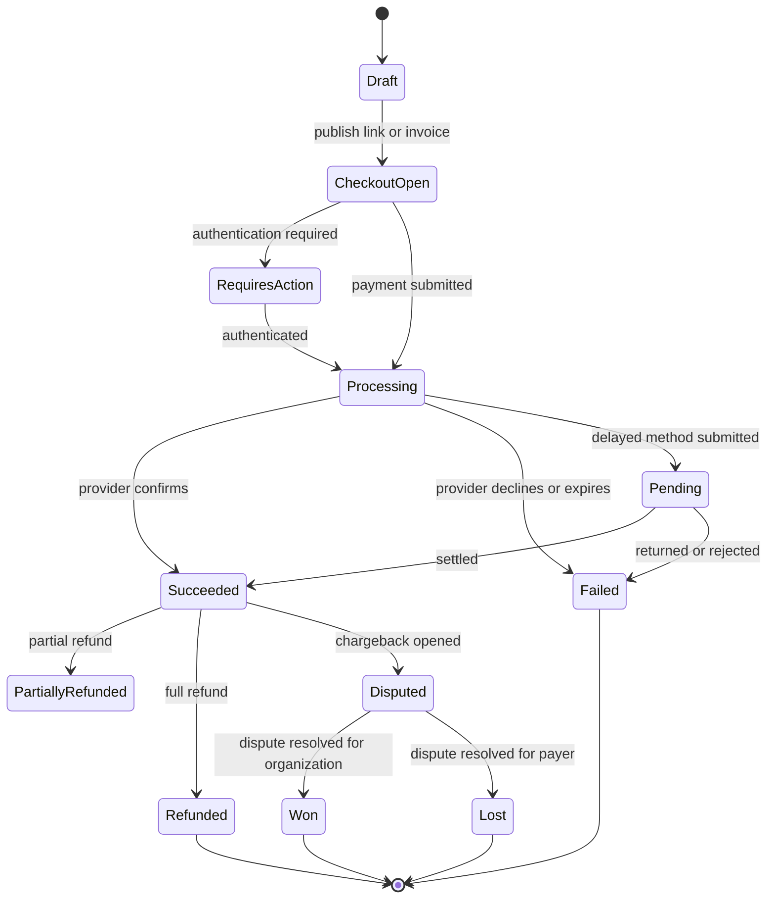
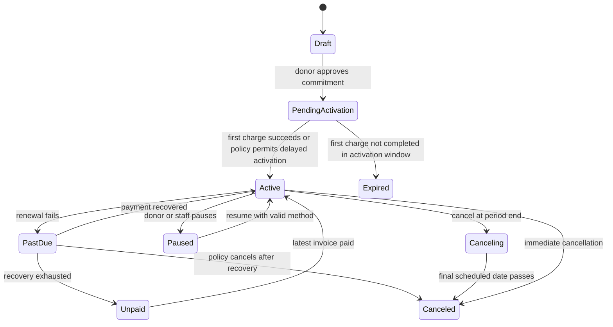

# New Payment Functionality

## Product Intent

Build **Payments** as a calm, trusted money lifecycle inside the CRM. It must make it effortless for a supporter to give once or join a recurring program, while giving staff one authoritative view of every pledge, charge, receipt, recovery attempt, refund, and relationship milestone.

The product does not optimize for more controls on screen. It optimizes for the next confident decision.

### Product promise

- A donor can complete a first gift in under a minute on mobile without creating an account.
- A recurring donor always knows the amount, cadence, next charge date, designation, and how to change or stop their gift.
- Staff can answer "what happened, what is next, and who owns it?" from one payment record.
- Money states are never guessed. Authorization, processing, settlement, failure, refund, dispute, and reconciliation remain visibly distinct.
- Automation does repetitive follow-through; people own gratitude, exceptions, and sensitive conversations.

## Research Foundation

The following sources informed the product decisions in this document. The implementation must verify the current provider capabilities and regional rules during technical design.

| Source | Applied learning |
| --- | --- |
| Stripe Payment Links | Shareable hosted payment pages, receipts, local methods, link attribution, donation support, and a clear distinction between reusable links and customer-specific invoices. |
| Stripe Billing Subscriptions | Subscription, invoice, and payment attempt are separate records with separate state transitions. Delayed methods such as ACH cannot be presented as final success. |
| Stripe Smart Retries | Retry recovery needs visible attempt count, next attempt, hard-decline handling, and a configurable terminal outcome. |
| PayPal Subscriptions | A simple product-plan-approval-confirmation flow supports recurring giving without forcing a donor through a billing console. |
| Adyen Tokenization | Stored credentials require explicit consent, a durable donor reference, tokenized payment data, and lifecycle management for expired or replaced cards. |
| Givebutter recurring-giving guidance | Recurring giving benefits from a monthly default, clear impact ladders, self-service, targeted welcome, impact updates, retention, and respectful upgrade moments. |
| Donorbox recurring donations | Donation forms must support campaign-specific giving, configurable recurrence, and branded embeddable collection surfaces. |
| Fundraise Up recurring donations | Giving should be optimized for conversion while retaining donor control over recurring commitment management. |
| Classy donation experience | Campaign, designation, donor acknowledgement, and receipt data are first-class fundraising requirements rather than generic payment metadata. |
| GoCardless recurring bank debit guidance | Bank-debit mandates, pending collection windows, and delayed confirmations need a deliberate lifecycle and donor-facing language. |

## Scope And Non-Goals

### In scope

- One-time donations, one-time payments, recurring donations, and recurring commercial payments.
- Hosted, embedded, and staff-assisted payment collection.
- Shareable payment links, campaign pages, invoices, quotes, and manual/offline payment records.
- Cards, wallets, ACH/direct debit, and provider-supported local payment methods.
- Donor records, payment methods, subscriptions, invoices, receipts, refunds, disputes, reconciliation, and accounting export/sync.
- Permissioned reporting, automation, notification, and donor self-service.

### Out of scope for the first release

- Holding raw card data or building a payment vault. A PCI-compliant provider owns sensitive payment credentials.
- Lending, installment financing, cryptocurrency, cross-border tax filing, or fiscal sponsorship rules.
- Replacing the accounting ledger. Payments sends normalized, reconcilable entries to accounting.

## Core Concepts

| Concept | Meaning |
| --- | --- |
| Supporter | A person or organization that pays or donates. Stored as a CRM Contact or Company. `Donor` is a relationship role, not a duplicate identity type. |
| Intent | A request to collect a defined amount. It is created before the provider confirms the money movement. |
| Payment | A successful, pending, failed, reversed, or refunded money movement. One intent can have multiple attempts. |
| Payment attempt | One provider authorization or collection attempt, including its provider reference, method, status, failure reason, and timestamps. |
| Gift | A donation-specific view of a payment with campaign, designation, acknowledgement, tax-receipt, anonymity, and employer-match data. |
| Subscription | A standing commitment with amount, cadence, next charge, payment method token, and lifecycle state. For donations, surface it as a `Recurring gift` to donors. |
| Invoice | A customer-specific request for payment. It can include a due date, reminders, partial payments, credits, and reconciliation. |
| Payment link | A reusable public checkout configuration. It may be a general donation link, campaign link, event link, or a fixed-price collection link. |
| Receipt | An immutable confirmation issued after the appropriate financial event. Tax language is configurable by organization and jurisdiction. |
| Designation | Where a gift is directed, such as `General fund`, `Scholarships`, or `Emergency relief`. |

## Information Architecture

Payments is a primary CRM module. The left navigation contains only these destinations:

1. **Overview**: what is healthy, at risk, and worth doing today.
2. **Collect**: create a link, invoice, quote-to-payment request, or staff-assisted payment.
3. **Transactions**: canonical payment and refund history.
4. **Recurring**: recurring gifts and subscriptions, grouped by health.
5. **Donors & Customers**: relationship-first financial history, not a duplicate contact list.
6. **Reconciliation**: deposits, accounting sync, and only unresolved exceptions.
7. **Settings**: providers, methods, receipts, policies, roles, and automation.

### Persistent page pattern

Every operational page uses the same three-part hierarchy:

- **Signal first**: one sentence that states the current condition.
- **Work next**: a short priority queue with one recommended action each.
- **History on demand**: filters and complete activity remain available but never compete with the next action.

Do not show a dense dashboard of every metric by default. Empty states must explain the next constructive action, not merely say there is no data.

## Overview: The Money Confidence View

The default overview answers four questions without scrolling:

| Question | Primary signal | Drill-in |
| --- | --- | --- |
| What arrived? | Settled revenue and gifts for the selected period | Transactions filtered to settled payments |
| What is expected? | Forecasted recurring value and invoices due | Recurring health or invoice collection view |
| What needs care? | Count of donor-safe recovery and reconciliation actions | A prioritized exception queue |
| What changed? | New recurring donors, recovered gifts, refunds, and significant churn | Activity timeline with causes |

### Overview behavior

- Default period: current month, with a compact period selector.
- Each metric explains its calculation on hover or focus and opens supporting records.
- The priority queue shows at most five items. Each item has a plain-language reason, owner, and one action.
- Celebrate meaningful milestones quietly: a newly activated recurring donor, a recovered gift, or a completed reconciliation batch. Never use celebratory animation for a donor's failed payment, cancellation, refund, or dispute.

## Collection Experiences

### Collection chooser

The `Collect payment` action opens a decision sheet with four choices, each in plain language:

| Choice | Use when | Result |
| --- | --- | --- |
| **Create a donation page** | Anyone should be able to support a campaign or fund | Reusable public payment link/page |
| **Send an invoice** | A known customer or donor owes a specific amount | Customer-specific invoice with due date |
| **Start a recurring gift** | A supporter wants an ongoing commitment | Hosted recurring-gift checkout or staff-assisted enrollment |
| **Record payment** | Cash, check, wire, or an already-settled external payment must be recorded | Auditable manual payment, never a fake processor charge |

The chooser gives one recommended option when invoked from a record or deal. It never asks the user to understand processor terminology first.

### Donation page builder

Create a donation page in one focused sequence:

1. **Purpose**: campaign, fund/designation, page title, short impact statement, and optional goal.
2. **Gift choices**: suggested amounts, custom amount, one-time and recurring frequency availability, and a meaningful impact label for each suggested amount.
3. **Donor details**: fields required by policy, receipt preferences, anonymous-gift option, employer match prompt, and optional dedication/memorial fields.
4. **Payment and sharing**: eligible payment methods, brand preview, success experience, tracking attribution, and share/embed options.

Advanced controls are hidden under `More options`. A builder preview updates in place and is mobile-first.

### One-time donation checkout

The public checkout must be one page or a short progressive flow with a visible step count only when more than one step is truly necessary.

1. **Choose gift**: amount chips, custom amount, designation, and one-time or recurring frequency. Preserve any UTM, campaign, and referral attribution invisibly.
2. **See impact**: immediately beneath the selected amount, show one factual, organization-controlled impact sentence. Do not fabricate urgency or use shame-based copy.
3. **Identify yourself**: name and email. Organization and address fields appear only when required for the selected receipt, payment method, or policy.
4. **Pay securely**: show only payment methods eligible for the amount, currency, and locale. Use provider-hosted/tokenized fields. Wallets are shown before manual card entry when available.
5. **Confirm**: show amount, cadence, designation, next charge date for recurring gifts, and a final submit label such as `Donate $25 monthly`.

#### Donation checkout rules

- The selected frequency must be unmistakable and remain visible near the final action.
- Monthly can be the recommended default for a recurring-focused campaign, but one-time must be equally easy to select.
- Fee coverage is opt-in, pre-calculated, reversible, and described neutrally.
- Anonymous donation controls must explain what becomes anonymous to the public versus staff.
- Do not require account creation before payment. Offer an optional secure management link after confirmation.
- Validate inline, preserve entered data after a provider decline, and never expose technical gateway errors.
- For a pending bank debit, confirm receipt of the commitment and state that the gift is processing. Do not say the money has been received until settled.

### Recurring gift checkout

Recurring giving is a commitment, not a hidden checkbox. The experience is intentionally explicit:

- Show cadence options as a compact segmented control: `Monthly`, `Quarterly`, `Annually`, plus only organization-enabled choices.
- Pair each recommended amount with annualized impact, for example: `$15 monthly = $180 over a year`.
- Before submit, show `First gift today`, `Next gift on [date]`, `You can change or cancel anytime`, and the selected designation.
- Obtain explicit consent to save the payment method and process future charges.
- For bank debit, show mandate text, processing timing, and when the first gift will be considered complete.
- After activation, issue a receipt for the successful charge and a separate welcome confirmation for the recurring commitment.

### Invoice collection

Invoice creation is customer-specific and supports products/services, donations by pledge, or a mixed request when policy allows.

- Draft from a Contact, Company, Deal, Quote, or blank invoice.
- Use a guided header for recipient, amount, due date, and purpose. Line items and tax are available in an expandable details area.
- Preview the hosted invoice exactly as the recipient will see it.
- Send by email, copy secure link, or download PDF. The sender chooses a reminder policy from a human-readable preset.
- Support partial payment, manual/offline payment, credit note, void, and write-off with clear permission checks and immutable audit events.

## Confirmation, Receipts, And Stewardship

The confirmation screen must be useful even if the donor never returns.

### Completed payment

- Lead with a clear confirmation: `Your gift is complete` or `Payment received`.
- Show amount, designation, payment date, receipt number, and donor-safe masked payment method.
- Provide receipt download/email, optional sharing, and `Manage recurring gift` when applicable.
- For donations, show a concise impact message and optional next relationship step such as newsletter signup, volunteer interest, or employer match. These must never block receipt access.

### Pending payment

- Say `Your payment is processing`, not `Thank you for your completed payment`.
- State what happens next, the expected timing range, and where confirmation will be sent.
- Do not create a tax receipt until the organization policy allows it for the payment method and settlement state.

### Receipt and acknowledgement policy

- Receipt templates are versioned, branded, and immutable after issuance.
- A receipt includes organization identity, receipt number, amount/currency, date, designation, payment reference, and required tax language.
- Acknowledgement is independent of receipt. Staff can send a personal thank-you without changing the financial record.
- New recurring donors trigger a welcome journey in addition to the first payment receipt.

## Donor And Customer Self-Service

Every recurring record issues a signed, time-limited management link. Logged-in portal access may be added later, but the link flow is required from day one.

Supporters can:

- View active and past recurring gifts.
- Update a payment method through the provider's secure collection flow.
- Change amount, cadence, designation when organization policy permits, next charge date, and communication preferences.
- Download receipts and see pending, successful, failed, refunded, or canceled charges.
- Pause for a defined period, cancel immediately or at period end, and optionally provide a reason.
- Restart a canceled recurring gift with an explicit new consent step.

### Respectful cancellation save flow

When someone chooses cancel, never trap them. Offer, in this order:

1. Confirm the requested cancellation and its effective date.
2. Offer optional alternatives: pause, lower amount, change cadence, or update payment method.
3. Make `Cancel recurring gift` equally visible and complete it in the same flow.
4. Confirm the outcome, future-charge behavior, receipt access, and rejoin path.

## Payment Lifecycle

The UI uses donor-friendly language. The underlying model uses explicit machine states and event history.

### One-time payment state machine

### Recurring gift state machine

### State presentation rules

| Technical state | Staff label | Donor label | Required next step |
| --- | --- | --- | --- |
| `Draft` | Not sent | Not visible | Complete or discard setup |
| `Processing` | Processing | Payment processing | Wait for provider event; do not fulfill or receipt early |
| `Pending` | Pending settlement | Payment processing | Show expected timing and monitor return/failure |
| `RequiresAction` | Donor action needed | Confirm your payment | Send secure completion link; do not retry blindly |
| `Failed` | Payment failed | We could not process this payment | Explain recovery path without exposing gateway codes |
| `PastDue` | Recovery in progress | Action needed to continue | Show next retry and update-method action |
| `Unpaid` | Recovery exhausted | Payment needs attention | Human-owned decision or donor restart path |
| `Succeeded` / `Active` | Healthy | Complete / Active | Receipt, acknowledgement, and stewardship |
| `Refunded` | Refunded | Refunded | Show refund amount, date, and original gift reference |
| `Disputed` | Dispute open | Payment under review | Restrict edits; assign an owner |

## Recovery And Exception Workflow

Recovery should feel attentive, not punitive. The system treats temporary issues, hard declines, and donor choice differently.

### Failure classification

| Class | Examples | System behavior |
| --- | --- | --- |
| Retryable | Insufficient funds, temporary network issue | Follow configured retry policy; show next attempt internally |
| Requires donor action | 3DS authentication, expired card, expired mandate | Stop automatic retry when appropriate; send secure update action |
| Non-retryable | Lost/stolen card, invalid account, fraud/high-risk block | Do not retry until a new method exists; create an exception task only if policy requires it |
| Provider ambiguity | Timeout or webhook delay | Mark `Processing`, deduplicate by idempotency key, reconcile before messaging donor |

### Recovery experience

1. Provider event creates or updates a payment attempt idempotently.
2. The record explains what failed in staff-safe language and identifies the policy-selected next action.
3. A donor receives one helpful message with a secure `Update payment method` link. Messages are rate-limited and pause when the donor acts.
4. Automatic retries run only for eligible failures and respect method-specific rules.
5. At recovery exhaustion, route the record to a defined outcome: remain past due, mark unpaid, cancel, or send to staff review.
6. A recovered charge automatically closes the recovery task, updates the recurring health score, sends the appropriate receipt, and records the recovery source.

### Staff exception queue

The queue is grouped by action, not provider code:

- `Confirm payment`: processing too long or provider event missing.
- `Help a donor update payment`: explicit donor-action need.
- `Review refund`: within authority threshold or waiting for approval.
- `Respond to dispute`: evidence deadline approaching.
- `Resolve reconciliation`: deposit, fee, or accounting mismatch.

Each row exposes one primary action and a compact history drawer. Bulk actions are allowed only for low-risk operational actions, never for refunds, disputes, or manual status overrides.

## Refunds, Reversals, And Disputes

### Refund workflow

1. Staff selects `Refund` from a settled payment.
2. The system shows refundable balance, original method, linked receipt, accounting impact, and required approval policy.
3. Staff enters amount, reason, internal note, and donor communication choice.
4. If threshold or role policy requires approval, status becomes `Refund requested`; no provider call occurs until approved.
5. On issue, create an immutable refund record, update payment state to partial/full refunded, adjust reporting, create accounting event, and send donor confirmation if selected.

Manual deletion or rewriting of a settled payment is forbidden. Correct financial history through a refund, reversal, credit note, void, or adjustment event.

### Dispute workflow

- Provider dispute events create a locked dispute case linked to payment, supporter, invoice, donation, and original receipt.
- Assign one owner, evidence deadline, amount at risk, and status.
- Surface provider-required evidence as a checklist. Preserve all submitted evidence and provider responses in the audit trail.
- Do not represent a disputed payment as available revenue in cash reporting until organization policy defines the treatment.

## CRM Relationships And Data Model

### Required entities

| Entity | Required fields |
| --- | --- |
| Payment link | ID, status, purpose, campaign, default designation, amount mode, currency, enabled methods, recurrence options, attribution settings, public URL, creator, version |
| Payment intent | ID, source type, supporter, amount, currency, purpose, designation, status, provider, idempotency key, created/updated timestamps |
| Payment attempt | ID, intent, provider payment reference, method type, method display, amount, currency, status, failure class/code, initiated/settled timestamps, processor fee, net amount |
| Payment | ID, intent, supporter, gross amount, fee, net amount, currency, settled date, status, receipt ID, provider reference, related invoice/subscription/gift |
| Gift | ID, payment, donor, campaign, designation, appeal, anonymous flag, dedication, acknowledgement status, tax-receipt status, soft credits, employer-match status |
| Subscription / recurring gift | ID, supporter, plan/version, amount, currency, cadence, designation, state, start date, next charge, payment method token reference, cancellation data, health status |
| Invoice | ID, recipient, line items, subtotal, tax, total, currency, due date, status, reminder policy, paid/remaining balance, related deal/quote |
| Receipt | ID, payment/gift, template version, issue date, delivery status, immutable rendered payload, tax language version |
| Refund | ID, payment, amount, reason, requested by, approval state, issued date, provider reference, accounting state |
| Reconciliation item | ID, provider payout/deposit, expected gross/fees/net, matched records, variance, state, owner |

### Relationship rules

- A Contact or Company can own many payments, gifts, invoices, payment links used, and recurring gifts.
- A Payment cannot be attached to more than one payment intent; the intent retains all attempts.
- A settled payment may create one or more gift allocations only if split-designation policy is enabled. Allocations must total the settled amount.
- Payment method tokens never store raw PAN, CVV, bank account numbers, or full provider payloads in CRM fields.
- Every provider webhook/event includes a unique provider event ID and is processed idempotently.
- Money is stored in minor units with ISO currency; display formatting is locale-aware.

## Automation

Automations are event-driven and visible on the record. Each automation has an owner, enablement state, version, test mode, and event log.

| Event | Default automation |
| --- | --- |
| One-time gift succeeds | Associate/create supporter, create gift, issue receipt, update campaign totals, optionally acknowledge new donor |
| First recurring gift succeeds | Activate recurring gift, issue receipt, send welcome, create optional relationship task, add to stewardship segment |
| Renewal succeeds | Issue receipt according to preference, update lifetime giving and recurring metrics |
| Payment needs donor action | Send secure update link, set recovery status, suppress duplicate notices |
| Recovery succeeds | Close task, record recovery, issue appropriate confirmation, restore active status |
| Recurring gift cancels | Update health, capture optional reason, start only approved re-engagement journey |
| Invoice overdue | Send configured reminder, create task only when value/risk threshold is met |
| Refund issued | Update gift/payment reporting, accounting export, receipt history, donor notification if selected |
| Dispute opened | Create high-priority case, assign owner, calculate deadline, freeze risky changes |
| Payout variance detected | Create reconciliation exception with linked source records |

Automation must never silently alter a financial state. Any state-changing provider event is retained in the activity log with source, timestamp, correlation ID, and before/after values.

## Reporting

### Executive metrics

- Gross, fees, refunds, chargebacks, and net settled value.
- One-time versus recurring revenue/gifts.
- Active recurring value, projected next 30/90 days, retention, churn, reactivation, and recovered revenue.
- Donation conversion by campaign, source, link, device, payment method, and frequency selection.
- Invoice collection rate, days outstanding, aging, partial-payment value, and reminder effectiveness.
- Reconciliation completion and unresolved variance.

### Donor-centered metrics

- First gift, latest gift, lifetime value, preferred designation, recurring tenure, cadence, and acknowledgement state.
- Never expose sensitive giving values to users without financial or relationship permission.
- Segment sustained donors, lapsed donors, repeat one-time donors, supporters with recoverable payment issues, and upgrade-ready donors using transparent criteria.

Every chart has a supporting-record drill-in and clearly labels whether values are authorized, pending, settled, refunded, or net.

## Permissions, Security, And Compliance

- Use provider-hosted fields, wallets, or tokenization to keep raw payment data out of the product.
- Separate permissions for collection configuration, refund approval, refund issue, manual payment recording, accounting export, dispute handling, and financial reporting.
- Require step-up authentication for provider connection changes, payout settings, large refunds, and role changes.
- Keep immutable audit events for all payment, refund, subscription, receipt, policy, and provider-connection changes.
- Apply least privilege to donor personal data. Do not show full payment details or provider tokens in activity feeds.
- Support consent records for saved payment methods, recurring authorization, communications, anonymity, and tax receipt delivery.
- Use accessible labels, keyboard navigation, visible focus, error summaries, non-color status indicators, and plain-language payment errors.

## WOW Moments That Earn Trust

These are high-value moments, not decorative features.

| Moment | Experience | Guardrail |
| --- | --- | --- |
| Impact preview | Selecting an amount reveals a factual, campaign-controlled impact statement and annualized recurring effect. | No invented urgency, manipulated defaults, or unverifiable claims. |
| Relationship memory | The donor record tells a concise story: first gift, total impact, current commitment, personal acknowledgement, and next relevant moment. | Financial data stays permissioned. |
| Quiet recovery | A donor receives one elegant, secure update action, while staff sees exactly why recovery is waiting. | No repeated nags or leaked processor decline text. |
| Welcome to belonging | A new recurring donor receives a purposeful welcome sequence beyond a receipt. | All communications respect consent and preferences. |
| Reconciliation confidence | The payout view resolves ordinary payments automatically and gives staff only true mismatches. | Never auto-resolve a variance without auditable rules. |
| One-record clarity | A payment record combines status, receipt, gift purpose, attempt history, related CRM context, and next action in one ordered view. | Do not crowd the first viewport with raw events or every integration field. |

## Build Sequence

### Phase 1: Trusted collection foundation

- Payment links and hosted checkout for one-time and recurring gifts.
- Contact/Company association, payment intent, attempt, payment, gift, receipt, and recurring-gift records.
- Provider webhooks with idempotency, receipt issuance, confirmation states, and donor-safe errors.
- Payment overview, transaction list, payment record, donor timeline, and basic self-service management link.

### Phase 2: Healthy recurring lifecycle

- Configurable cadence, designation, payment method update, pause/cancel, welcome journeys, and recurring-health dashboard.
- Retry/dunning policy, donor-action messages, failure classifications, recovery queue, and reactivation.
- Invoice creation, reminder policies, offline payment recording, partial payment, and accounting-ready exports.

### Phase 3: Financial operations maturity

- Refund approvals, disputes, credit notes, payout reconciliation, accounting sync, and variance queue.
- Campaign and attribution reporting, advanced donor segmentation, upgrade journeys, multi-currency reporting, and permission audit dashboards.

## Acceptance Criteria

### One-time donation

- A donor can select amount, designation, privacy preference, and eligible method; complete checkout; receive a receipt; and see the gift on the CRM record.
- A pending bank debit produces `Processing`/`Pending` messaging and does not count as settled revenue or issue a final tax receipt prematurely.
- A retry after a browser refresh or delayed webhook cannot create a duplicate payment, receipt, or donor record.

### Recurring donation

- A donor sees cadence, first charge, next charge, amount, designation, and cancellation/update path before authorizing recurring billing.
- A successful first charge activates the recurring gift, creates the payment and gift, issues a receipt, and triggers the welcome automation exactly once.
- A failed renewal exposes a recovery state, schedules only policy-allowed retries, offers secure self-service, and returns to active upon successful recovery.
- Cancellation is easy, accurately effective immediately or at period end, and keeps the financial history intact.

### Operations

- Staff can trace any amount from dashboard metric to payment to attempt/provider event to receipt, refund, and payout reconciliation item.
- Staff cannot edit a settled amount, delete a payment, or issue an unauthorized refund.
- Every financial change has an auditable actor, timestamp, source, reason, and linked records.
- `npm run build`, lint, accessibility checks, provider-webhook tests, and lifecycle transition tests must pass before release.

## Open Decisions Before Implementation

1. Which payment processor(s), countries, currencies, and legal entities are supported at launch?
2. What tax receipt language, gift acknowledgement rules, and refund authority thresholds apply to each organization?
3. Are split designations, tributes, soft credits, employer matching, and donor-advised fund workflows needed in the first release?
4. What are the approved retry schedule, dunning tone, communication limits, cancellation policy, and reactivation policy?
5. Which accounting system is authoritative, and what settlement/fee/refund mapping is required for reconciliation?
6. Which roles can view donor amounts, export data, issue refunds, manage provider settings, and respond to disputes?
